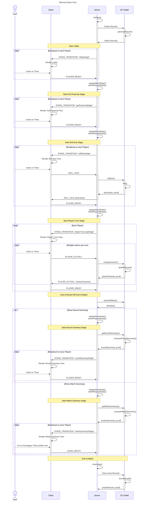

```mermaid
---
title: Boloney Match Flow
---
sequenceDiagram
    actor user as User
    participant client as Client
    participant server as Server
    participant toolkit as ZK Toolkit

    link client: React @ https://reactjs.org/
    link server: Nakama @ https://heroiclabs.com/nakama/

    %% Init Match & Lobby
    server->>+server: InitMatch
    server->>+toolkit: Create Records
    toolkit->>toolkit: generateRecords
    toolkit->>-server: Match Records

    Note over client,server: Start Lobby

    loop Broadcast to each Player
        server->>+client: STAGE_TRANSITION: "lobbyStage"
        client->>client: Render Lobby
        user-->>client: Action or Timer
        client->>-server: PLAYER_READY
        deactivate server
    end

    %% Get PowerUps Stage
    server->>+server: updateMatchState() <br/> areAllPlayersReady()
    Note over client,server: Start Get PowerUp Stage

    loop Broadcast to each Player
        server->>+client: STAGE_TRANSITION: "getPowerUpStage"
        client->>client: Render Get PowerUp Flow
        user-->>client: Action or Timer
        client->>-server: PLAYER_READY
        deactivate server
    end

    %% Roll Dice Stage
    server->>+server: updateMatchState() <br/> areAllPlayersReady()
    Note over client,server: Start Roll Dice Stage

    loop Broadcast to each Player
        server->>+client: STAGE_TRANSITION: "rollDiceStage"
        client->>client: Render Roll Dice Flow
        user-->>client: Action or Timer
        client->>+server: ROLL_DICE
        server->>+toolkit: rollDice()
        toolkit->>toolkit: RNG
        toolkit->>-server: {diceValue, proof}
        server->>-client: ROLL_DICE {diceValue}
        client->>-server: PLAYER_READY
        deactivate server
    end

    %% Players Turn Stage
    server->>+server: updateMatchState() <br/> areAllPlayersReady()
    Note over client,server: Start Players Turn Stage

    loop Each Player
        server->>+client: STAGE_TRANSITION: "playerTurnLoopStage"
        client->>client: Render Player's Turn Flow
        loop Multiple actions per turn
            user-->>client: Action or Timer
            client->>+server: PLAYER_ACTION_*
            server->>+toolkit: computeAction(*)
            toolkit->>toolkit: updateRecord()
            toolkit->>-server: {actionPayload, proof}
            server->>-client: PLAYER_ACTION_* {actionOutcome}
        end
        client->>-server: PLAYER_READY
        deactivate server
    end

    Note over client,server: End of Round OR End of Match

    server->>+toolkit: isEndOfMatch()
    toolkit->>-server: {boolean}

    alt Show Round Summary
        %% Round Summary Stage
        server->>+server: updateMatchState() <br/> areAllPlayersReady()
        Note over client,server: Start Round Summary Stage

        server->>+toolkit: getRoundSummary()
        toolkit->>toolkit: computeRoundSummary()
        toolkit->>-server: {roundSummary, proof}

        loop Broadcast to every Player
            server->>+client: STAGE_TRANSITION: "roundSummaryStage"
            client->>client: Render Round Summary View
            user-->>client: Action or Timer
            client->>-server: PLAYER_READY
            deactivate server
        end

    else Show Match Summary
        %% Match Summary Stage
        server->>+server: updateMatchState() <br/> areAllPlayersReady()
        Note over client,server: Start Match Summary Stage

        server->>+toolkit: getMatchSummary()
        toolkit->>toolkit: computeMatchSummary()
        toolkit->>-server: {matchSummary, proof}

        loop Broadcast to every Player
            server->>+client: STAGE_TRANSITION: "matchSummaryStage"
            client->>client: Render Match Summary View
            user-->>client: Go to Homepage / Play another one
            client->>-server: LEAVE_MATCH
            deactivate server
        end
    end

    Note over client,toolkit: End of Match

     %% Clean up Match
    server->>+server: cleanMatch
    server->>+toolkit: Clean temp Records
    toolkit->>toolkit: burnRecords()
    toolkit->>-server: {matchRecord, proof}

```
